<!-- Generated by GitHub Profile Agent Console. Edit profile.config.json, then run npm run generate. -->

  <picture>
    <source media="(max-width: 760px) and (prefers-color-scheme: dark)" srcset="./assets/hero/agent-console-arifuong-mobile-dark.svg">
    <source media="(max-width: 760px)" srcset="./assets/hero/agent-console-arifuong-mobile-light.svg">
    <source media="(prefers-color-scheme: dark)" srcset="./assets/hero/agent-console-arifuong-dark.svg">
    <source media="(prefers-color-scheme: light)" srcset="./assets/hero/agent-console-arifuong-light.svg">
    
  </picture>

  

## About Me

Saya adalah mahasiswa Informatika yang memiliki ketertarikan pada pengembangan aplikasi web modern.

Saat ini saya sedang mendalami Laravel, React, JavaScript, PHP, Node.js, dan Python.

Saya senang membangun aplikasi web yang modern, cepat, responsif, dan mudah digunakan.

## Current Focus

| Area | What I am exploring |
| --- | --- |
| **Full Stack Development** | Building complete web applications from database to user interface. |
| **Web Development** | Creating modern, responsive, and accessible websites. |
| **Frontend Development** | Crafting interactive user interfaces with React and Tailwind CSS. |
| **Backend Development** | Designing robust APIs and server-side logic with Laravel and Node.js. |
| **REST API Development** | Building scalable and well-documented RESTful APIs. |
| **Responsive Web Design** | Ensuring seamless experiences across all devices and screen sizes. |

## Featured Work

| Project | Focus | Why it matters |
| --- | --- | --- |
| [**ProjectPBO**](https://github.com/arifuong/projectpbo) | Java OOP | Project Object Oriented Programming menggunakan Java untuk pembelajaran konsep OOP. |
| [**Tracer Study**](https://github.com/arifuong/tracer_study) | Laravel web app | Website Tracer Study berbasis Laravel untuk pelacakan alumni. |
| [**Pakar Ginjal**](https://github.com/arifuong/sistem-pakar-ginjal-) | Expert system | Sistem pakar diagnosa penyakit ginjal berbasis web menggunakan metode Certainty Factor. |
| [**TiketKeretaOOP**](https://github.com/arifuong/TiketKeretaOOP) | OOP simulation | Aplikasi simulasi pemesanan tiket kereta api menggunakan konsep OOP Java. |
| [**Pakar Kucing**](https://github.com/arifuong/sistem-pakar_diagnosa-penyakit-kucing-) | Expert system | Sistem pakar diagnosa penyakit kucing berbasis web untuk deteksi dini. |
| [**Ketupat Cinta**](https://github.com/arifuong/ketupat_cinta) | Interactive web | Website interaktif bertema Ketupat Cinta dengan desain modern dan responsif. |
| [**Aurevia**](https://github.com/arifuong/Aurevia) | Web application | Modern web application yang sedang dikembangkan dengan teknologi terkini. |
| [**Portfolio**](https://arifuong.github.io) | Personal portfolio | Personal portfolio website menampilkan proyek dan skills dalam web development. [Live](https://arifuong.github.io) |

## Research Direction

I focus on building modern web applications using Laravel and React, combining backend reliability with responsive frontend experiences. Every project is an opportunity to learn and improve.

## Tech Stack

`HTML5` · `CSS3` · `JavaScript` · `Bootstrap` · `Tailwind CSS` · `React` · `PHP` · `Laravel` · `Node.js` · `Python` · `Spring Boot` · `MySQL` · `Git` · `GitHub` · `VS Code`

## Recent Activity

<!-- AUTO:ACTIVITY:START -->
_Recent public activity will appear here after the workflow runs._
<!-- AUTO:ACTIVITY:END -->

---

  Building modern web applications and sharing what works.

